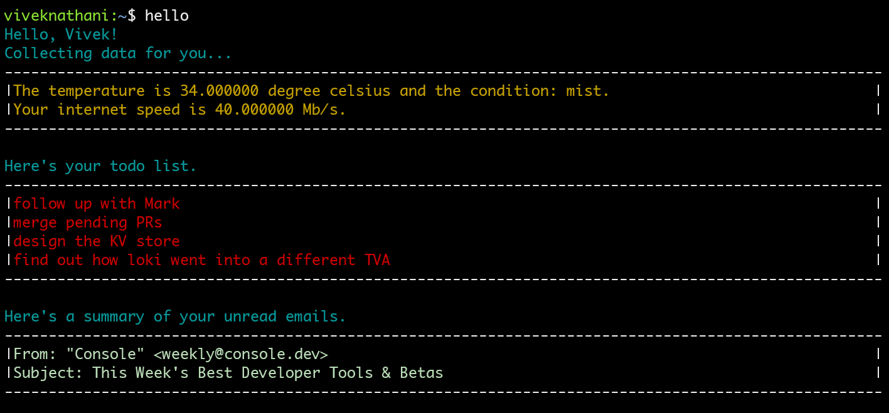

# hello
[](https://goreportcard.com/report/github.com/viveknathani/hello) [](https://codeclimate.com/github/viveknathani/hello/maintainability)

hello is a personalized terminal dashboard that I have built for myself.



## setup

You need to setup the environment variables.
The .env file looks like the following.

```bash
USER_NAME=Name # a placeholder to show in terminal
WEATHER_API_KEY=ffffffffffffffffffffffff # from https://www.weatherapi.com/
WEATHER_API_CITY=City
TODO_API_KEY=aaaaaaaaaaaffff23456666677701 # from https://todoist.com/
HOME_USER=name # the name of user in the system
```

You also need to setup your GMail API's `credentials.json` which will be used to create another file `token.json`. 

You should create a directory `hello` under `/home/$USER`. 
All the environment files should be stored under `/home/$USER/hello` directory. 

## build

``` bash
    make build
```

This will create a binary and copy it to `/home/$USER/hello` directory.

You should now configure your .bashrc file to add the `PATH` to this produced binary.

If you have reached here, typing `hello` from any directory in your console should start the program. If it is the first time, the GMail client will ask you to authorize this app to use your account for reading emails. Do note that the app's details have to be set by yourself in the Google Cloud Platform. It is your self-created version, not run by the original author.

## contributing

If you are interested in working on this project, check the [contributing guidelines](./CONTRIBUTING.md).

## license

[MIT](./LICENSE)
